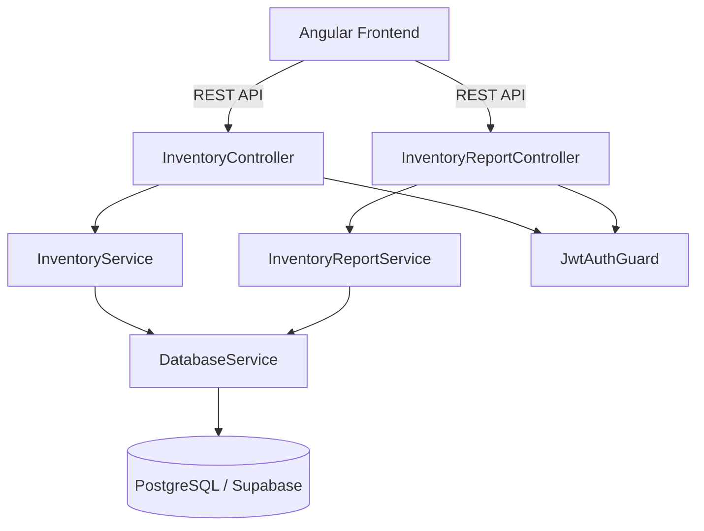

# Design Document: Inventory Module

## Overview

The Inventory Module provides comprehensive product/accessories inventory management for the Car Expert organization within CBIS. It covers:

- **Product CRUD** with server-side pagination, filtering, and stock status classification
- **Purchase Order lifecycle** — creation with multi-item support, payment details, supplier linking, and receiving (stock update)
- **Monthly inventory reporting** — daily sales breakdown, beginning balance, ending inventory, actual count, and shortage calculation
- **Data export** — CSV/Excel downloads for inventory lists and monthly reports

The module is built as a NestJS service using raw SQL via the existing `DatabaseService` (pg Pool wrapper), scoped to the authenticated user's organization.

## Architecture



**Key architectural decisions:**

1. **Single module, split services** — `InventoryService` handles products, POs, and suppliers. `InventoryReportService` handles monthly report generation and export. Both live in the `inventory` module.
2. **Raw SQL via DatabaseService** — Consistent with the rest of the codebase. No ORM.
3. **Transaction support** — PO creation and receiving use `DatabaseService.withTransaction()` for atomicity.
4. **Org scoping** — Every query includes `org_id = $N` condition extracted from JWT payload.

## Components and Interfaces

### Controllers

**InventoryController** (`/inventory`)
| Method | Endpoint | Description | Req |
|--------|----------|-------------|-----|
| GET | `/inventory` | Paginated product list with metrics | 1 |
| GET | `/inventory/download` | Export inventory as CSV | 4 |
| GET | `/inventory/:id` | Single product detail | — |
| POST | `/inventory` | Create product | 3 |
| PATCH | `/inventory/:id` | Update product | — |
| POST | `/inventory/:id/adjust-stock` | Manual stock adjustment | — |
| GET | `/inventory/search` | Product smart search (for PO) | 9 |
| GET | `/inventory/low-stock` | Low stock products | — |
| GET | `/inventory/suppliers` | List all suppliers | — |
| GET | `/inventory/suppliers/search` | Supplier smart search | 8 |
| GET | `/inventory/purchase-orders` | List POs | 7 |
| GET | `/inventory/purchase-orders/:id` | View PO detail | 6 |
| POST | `/inventory/purchase-orders` | Create PO | 5 |
| POST | `/inventory/purchase-orders/:id/receive` | Receive PO (update stock) | 13 |

**InventoryReportController** (`/inventory/reports`)
| Method | Endpoint | Description | Req |
|--------|----------|-------------|-----|
| GET | `/inventory/reports/monthly` | Monthly inventory report | 10 |
| POST | `/inventory/reports/monthly/actual-count` | Save actual count | 11 |
| GET | `/inventory/reports/monthly/export` | Export report to Excel | 12 |

### Services

**InventoryService** — Product CRUD, PO lifecycle, supplier/product search, stock adjustments, CSV export.

**InventoryReportService** — Monthly report generation (beginning balance, daily sales, ending inventory, actual count, shortage), Excel export.

### DTOs (validation via class-validator or manual checks)

- `PaginatedQueryDto` — `{ page: number, pageSize: number, search?: string, status?: string, deliveryDateFrom?: string, deliveryDateTo?: string }`
- `CreateProductDto` — `{ partName: string, brand?: string, category?: string, ... }`
- `CreatePurchaseOrderDto` — `{ supplierId: number, paymentType?: string, paymentDate?: string, paymentAmount?: number, referenceNumber?: string, paymentNotes?: string, comments?: string, items: PurchaseOrderItemDto[] }`
- `PurchaseOrderItemDto` — `{ inventoryId?: number, itemName: string, brand?: string, category?: string, quantity: number, unitCost: number }`
- `ActualCountDto` — `{ productId: number, month: string (YYYY-MM), count: number }`
- `MonthlyReportQueryDto` — `{ month: string (YYYY-MM), category?: string }`

## Data Models

### Database Tables

#### `tblinventory` (existing — formalize schema)

```sql
CREATE TABLE IF NOT EXISTS public.tblinventory (
  id              BIGSERIAL PRIMARY KEY,
  org_id          BIGINT NOT NULL REFERENCES public.tblorganizations(id),
  part_name       TEXT NOT NULL,
  category        TEXT,
  brand           TEXT,
  description     TEXT,
  stock_qty       INTEGER NOT NULL DEFAULT 0,
  stock_warning   INTEGER NOT NULL DEFAULT 0,
  cost_price      NUMERIC(12,2) NOT NULL DEFAULT 0,
  selling_price   NUMERIC(12,2) NOT NULL DEFAULT 0,
  max_discount_price NUMERIC(12,2),
  created_at      TIMESTAMPTZ NOT NULL DEFAULT NOW(),
  updated_at      TIMESTAMPTZ NOT NULL DEFAULT NOW()
);

CREATE INDEX IF NOT EXISTS idx_tblinventory_org_id ON public.tblinventory(org_id);
CREATE INDEX IF NOT EXISTS idx_tblinventory_part_name ON public.tblinventory(LOWER(part_name));
```

#### `tblsuppliers` (existing — formalize schema)

```sql
CREATE TABLE IF NOT EXISTS public.tblsuppliers (
  id              BIGSERIAL PRIMARY KEY,
  org_id          BIGINT NOT NULL REFERENCES public.tblorganizations(id),
  name            TEXT NOT NULL,
  contact_info    TEXT,
  email           TEXT,
  address         TEXT,
  created_at      TIMESTAMPTZ NOT NULL DEFAULT NOW(),
  updated_at      TIMESTAMPTZ NOT NULL DEFAULT NOW()
);

CREATE INDEX IF NOT EXISTS idx_tblsuppliers_org_id ON public.tblsuppliers(org_id);
CREATE INDEX IF NOT EXISTS idx_tblsuppliers_name ON public.tblsuppliers(LOWER(name));
```

#### `tblpurchases` (existing — add payment fields)

```sql
CREATE TABLE IF NOT EXISTS public.tblpurchases (
  id              BIGSERIAL PRIMARY KEY,
  org_id          BIGINT NOT NULL REFERENCES public.tblorganizations(id),
  supplier_id     BIGINT REFERENCES public.tblsuppliers(id),
  po_number       TEXT,
  status          TEXT NOT NULL DEFAULT 'draft' CHECK (status IN ('draft','received','cancelled')),
  notes           TEXT,
  order_date      DATE,
  expected_date   DATE,
  -- Payment details (inline, not separate table)
  payment_type    TEXT,
  payment_date    DATE,
  payment_amount  NUMERIC(12,2) DEFAULT 0,
  reference_number TEXT,
  payment_notes   TEXT,
  created_by      BIGINT REFERENCES public.tblusers(id),
  created_at      TIMESTAMPTZ NOT NULL DEFAULT NOW(),
  updated_at      TIMESTAMPTZ NOT NULL DEFAULT NOW()
);

CREATE INDEX IF NOT EXISTS idx_tblpurchases_org_id ON public.tblpurchases(org_id);
CREATE INDEX IF NOT EXISTS idx_tblpurchases_status ON public.tblpurchases(status);
CREATE INDEX IF NOT EXISTS idx_tblpurchases_order_date ON public.tblpurchases(order_date);
```

#### `tblpo_items` (existing — formalize)

```sql
CREATE TABLE IF NOT EXISTS public.tblpo_items (
  id              BIGSERIAL PRIMARY KEY,
  purchase_id     BIGINT NOT NULL REFERENCES public.tblpurchases(id) ON DELETE CASCADE,
  inventory_id    BIGINT REFERENCES public.tblinventory(id),
  item_name       TEXT NOT NULL,
  quantity        INTEGER NOT NULL DEFAULT 1,
  unit_cost       NUMERIC(12,2) NOT NULL DEFAULT 0,
  total_cost      NUMERIC(12,2) NOT NULL DEFAULT 0,
  created_at      TIMESTAMPTZ NOT NULL DEFAULT NOW()
);

CREATE INDEX IF NOT EXISTS idx_tblpo_items_purchase_id ON public.tblpo_items(purchase_id);
CREATE INDEX IF NOT EXISTS idx_tblpo_items_inventory_id ON public.tblpo_items(inventory_id);
```

#### `tblsales_transactions` (NEW — track daily sales)

```sql
CREATE TABLE IF NOT EXISTS public.tblsales_transactions (
  id              BIGSERIAL PRIMARY KEY,
  org_id          BIGINT NOT NULL REFERENCES public.tblorganizations(id),
  inventory_id    BIGINT NOT NULL REFERENCES public.tblinventory(id),
  quantity_sold   INTEGER NOT NULL DEFAULT 1,
  unit_price      NUMERIC(12,2) NOT NULL DEFAULT 0,
  total_amount    NUMERIC(12,2) NOT NULL DEFAULT 0,
  sale_date       DATE NOT NULL DEFAULT CURRENT_DATE,
  created_by      BIGINT REFERENCES public.tblusers(id),
  created_at      TIMESTAMPTZ NOT NULL DEFAULT NOW()
);

CREATE INDEX IF NOT EXISTS idx_tblsales_transactions_org_date ON public.tblsales_transactions(org_id, sale_date);
CREATE INDEX IF NOT EXISTS idx_tblsales_transactions_inventory ON public.tblsales_transactions(inventory_id, sale_date);
```

#### `tblinventory_actual_counts` (NEW — monthly physical counts)

```sql
CREATE TABLE IF NOT EXISTS public.tblinventory_actual_counts (
  id              BIGSERIAL PRIMARY KEY,
  org_id          BIGINT NOT NULL REFERENCES public.tblorganizations(id),
  inventory_id    BIGINT NOT NULL REFERENCES public.tblinventory(id),
  month           DATE NOT NULL, -- first day of month (e.g., 2026-03-01)
  actual_count    INTEGER NOT NULL DEFAULT 0,
  updated_by      BIGINT REFERENCES public.tblusers(id),
  updated_at      TIMESTAMPTZ NOT NULL DEFAULT NOW(),
  UNIQUE(org_id, inventory_id, month)
);

CREATE INDEX IF NOT EXISTS idx_tblinventory_actual_counts_lookup
  ON public.tblinventory_actual_counts(org_id, month);
```

### Key Algorithms

#### Stock Status Classification

```typescript
function getStockStatus(quantity: number, stockWarning: number): 'Good' | 'Warning' | 'Bad' {
  if (quantity > stockWarning) return 'Good';
  if (quantity === stockWarning) return 'Warning';
  return 'Bad';
}
```

#### Beginning Balance Calculation

The beginning balance for a product in month M is the `stock_qty` at the end of month M-1. Calculated as:

```sql
-- Beginning balance = stock at end of previous month
-- Approach: current stock - (this month's purchases) + (this month's sales)
-- OR: use a snapshot approach

-- Practical approach: compute from current stock working backwards
-- beginning_balance = current_stock_qty - purchases_this_month + sales_this_month
```

For the first implementation, we compute beginning balance as:
`Beginning_Balance = Current_Stock - Total_Purchases_This_Month + Total_Sales_This_Month`

This is equivalent to the stock level at the start of the month.

#### Monthly Report Row Calculation

For each product in the selected month:
1. **Beginning_Balance** = `stock_qty` - (sum of PO quantities received this month) + (sum of sales this month)
2. **Daily Sales** = `GROUP BY sale_date` from `tblsales_transactions` for the month
3. **Total_Sales** = sum of all daily sales quantities
4. **Total_Purchase** = sum of quantities from received POs in the month
5. **Ending_Inventory** = Beginning_Balance + Total_Purchase - Total_Sales
6. **Inventory_Shortage** = Ending_Inventory - Actual_Count
7. **Remark** = "GOOD" if Shortage == 0, else "BAD"

#### PO Number Generation

Auto-generated format: `PO-{YYYYMMDD}-{sequence}` where sequence is a zero-padded counter per org per day.

```sql
SELECT 'PO-' || TO_CHAR(NOW(), 'YYYYMMDD') || '-' || LPAD((COUNT(*) + 1)::TEXT, 4, '0')
FROM tblpurchases
WHERE org_id = $1 AND DATE(created_at) = CURRENT_DATE;
```

#### Purchased Quantity (Current Month)

For the inventory list, "Purchased_Quantity" = total units sold this month:
```sql
SELECT COALESCE(SUM(st.quantity_sold), 0)
FROM tblsales_transactions st
WHERE st.inventory_id = $1
  AND st.sale_date >= DATE_TRUNC('month', CURRENT_DATE)
  AND st.sale_date < DATE_TRUNC('month', CURRENT_DATE) + INTERVAL '1 month'
```

#### Month Sales (Current Month)

Total monetary sales value:
```sql
SELECT COALESCE(SUM(st.total_amount), 0)
FROM tblsales_transactions st
WHERE st.inventory_id = $1
  AND st.sale_date >= DATE_TRUNC('month', CURRENT_DATE)
  AND st.sale_date < DATE_TRUNC('month', CURRENT_DATE) + INTERVAL '1 month'
```

## Correctness Properties

*A property is a characteristic or behavior that should hold true across all valid executions of a system — essentially, a formal statement about what the system should do. Properties serve as the bridge between human-readable specifications and machine-verifiable correctness guarantees.*

### Property 1: Stock status classification is correct

*For any* product with a given `quantity` and `stockWarning` threshold, the computed Stock_Status SHALL be "Good" when quantity > stockWarning, "Warning" when quantity == stockWarning, and "Bad" when quantity < stockWarning.

**Validates: Requirements 1.4**

### Property 2: Pagination returns correct slice

*For any* list of N products and valid page/pageSize parameters, the returned page SHALL contain exactly `min(pageSize, N - (page-1)*pageSize)` items starting at offset `(page-1)*pageSize`, ordered by product name ascending.

**Validates: Requirements 1.1, 1.2**

### Property 3: Page totals equal sum of page items

*For any* page of product results, the totals summary values (quantity, cost, SRP, purchasedQuantity, monthSales) SHALL equal the sum of the corresponding fields across all items on that page.

**Validates: Requirements 1.5**

### Property 4: Search filter returns only matching products

*For any* search text and set of products, all returned products SHALL have the search text (case-insensitive) contained in at least one of: product name, brand, or category. No product matching the criteria shall be excluded.

**Validates: Requirements 2.1**

### Property 5: Combined filters use AND logic

*For any* combination of search text, stock status filter, and delivery date range applied simultaneously, the result set SHALL equal the intersection of applying each filter individually.

**Validates: Requirements 2.4**

### Property 6: Product creation round-trip

*For any* valid product name and any combination of optional fields (brand, category, description, stockQty, stockWarning, costPrice, sellingPrice, maxDiscountPrice), creating the product SHALL succeed, return a positive integer ID, and retrieving by that ID SHALL return all provided field values unchanged.

**Validates: Requirements 3.1, 3.3, 3.5**

### Property 7: Empty/whitespace product names are rejected

*For any* string composed entirely of whitespace characters (including empty string), attempting to create a product SHALL return a validation error and not create any record.

**Validates: Requirements 3.2, 3.4**

### Property 8: PO total cost equals sum of line items

*For any* Purchase Order with N items (N >= 1), the total cost SHALL equal the sum of (quantity × unitCost) for all PO items.

**Validates: Requirements 5.7**

### Property 9: PO view returns complete data round-trip

*For any* created Purchase Order with items and payment details, viewing that PO SHALL return all header fields, all items with correct quantities/costs/line totals, payment details, and correct aggregate totals (total quantity, total cost).

**Validates: Requirements 6.1, 6.2, 6.3, 6.4**

### Property 10: PO list truncates product names at 3

*For any* Purchase Order with N items, the list endpoint SHALL return min(N, 3) product names and a `hasMore` flag that is true when N > 3 and false otherwise.

**Validates: Requirements 7.2, 7.3**

### Property 11: Receiving PO increases stock by ordered quantity

*For any* Purchase Order in "draft" status with items linked to inventory products, receiving the PO SHALL increase each product's stock_qty by exactly the ordered quantity, and the PO status SHALL become "received".

**Validates: Requirements 13.1, 13.2**

### Property 12: Monthly report ending inventory formula

*For any* product in a monthly report, Ending_Inventory SHALL equal Beginning_Balance + Total_Purchase - Total_Sales, Inventory_Shortage SHALL equal Ending_Inventory - Actual_Count, and Remark SHALL be "GOOD" when Shortage == 0 and "BAD" otherwise.

**Validates: Requirements 10.6, 10.8, 10.9**

### Property 13: Total sales equals sum of daily sales

*For any* product in a monthly report, Total_Sales SHALL equal the sum of all daily sales quantities for that month.

**Validates: Requirements 10.4**

### Property 14: Organization scoping isolation

*For any* entity type (Product, Purchase Order, Supplier, Report data) and any two distinct organizations, querying as organization A SHALL never return data belonging to organization B. Attempting to access org B's resource from org A SHALL return a not-found error.

**Validates: Requirements 14.1, 14.2, 14.3, 14.4, 14.5**

### Property 15: Supplier search returns matching results within limit

*For any* search text and set of suppliers, all returned suppliers SHALL have names containing the search text (case-insensitive), and the result count SHALL not exceed 20.

**Validates: Requirements 8.1**

## Error Handling

### Approach

All service methods follow the existing codebase pattern of returning `{ success: boolean, message?: string, data?: T }` response objects. Errors are caught at the service level and returned as structured responses rather than throwing HTTP exceptions.

### Error Categories

| Category | HTTP Status | Response Shape | Example |
|----------|-------------|----------------|---------|
| Validation Error | 400 | `{ success: false, message: "..." }` | Missing product name, negative actual count |
| Not Found | 404 | `{ success: false, message: "..." }` | Invalid PO ID, cross-org access attempt |
| Business Rule | 409 | `{ success: false, message: "..." }` | PO already received |
| Server Error | 500 | `{ success: false, message: "..." }` | Database connection failure |

### Validation Rules

- **Product creation**: `partName` required, non-empty after trim
- **PO creation**: `supplierId` required, `items` array must have >= 1 element, each item needs `quantity > 0` and `unitCost >= 0`
- **Actual count**: must be non-negative integer
- **Pagination**: `page >= 1`, `pageSize` between 1 and 100

### Cross-Org Access

When a resource is requested with an ID that belongs to a different org, the service returns a generic "not found" message — never revealing whether the resource exists in another org. This is enforced by always including `org_id = $N` in WHERE clauses.

## Testing Strategy

### Unit Tests (Jest)

- **Stock status classification** — example-based tests for boundary values (0, equal to warning, above warning)
- **PO total calculation** — verify sum logic with known inputs
- **Report formula calculations** — verify Beginning_Balance, Ending_Inventory, Shortage with known data
- **Validation logic** — empty names, missing suppliers, negative counts
- **PO number generation** — format verification

### Property-Based Tests (fast-check)

The project will use [fast-check](https://github.com/dubzzz/fast-check) for property-based testing.

- **Property 1**: Generate random (quantity, stockWarning) pairs → verify classification
- **Property 2**: Generate random product arrays + page params → verify slice correctness
- **Property 3**: Generate random product metric arrays → verify sum equals totals
- **Property 5**: Generate random filter combinations → verify AND intersection
- **Property 7**: Generate whitespace strings → verify rejection
- **Property 8**: Generate random PO items → verify total = sum(qty × unitCost)
- **Property 12**: Generate random (beginning, purchase, sales, actual) tuples → verify formulas
- **Property 13**: Generate random daily sales arrays → verify sum

Each property test runs minimum 100 iterations. Tests are tagged:
```
// Feature: inventory-module, Property 1: Stock status classification is correct
```

### Integration Tests

- **PO receive flow** — create PO → receive → verify stock updated and status changed (transactional)
- **Monthly report generation** — seed sales data → generate report → verify daily columns and totals
- **Excel export** — verify file generation with correct content-type and column structure
- **Cross-org isolation** — create data in org A, attempt access from org B, verify not-found

### E2E Tests

- Full PO lifecycle: create supplier → create PO → receive → verify inventory updated
- Monthly report with actual count entry and shortage calculation
